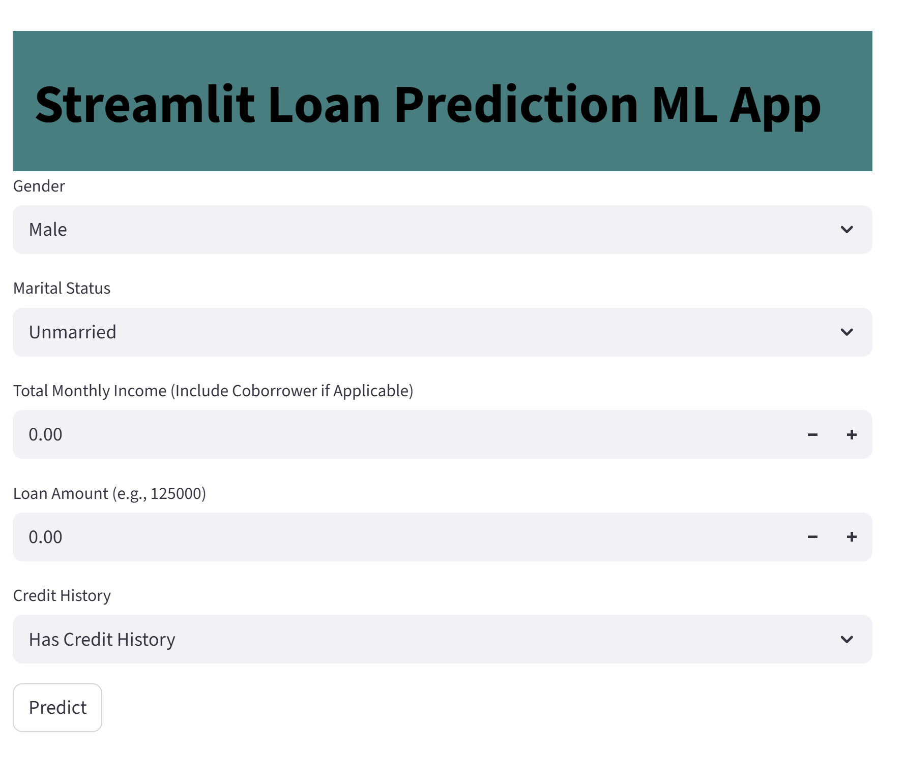

#  Loan Approval Prediction – Random Forest Web App

##  Project Overview  
This project demonstrates a complete machine learning workflow — from data preparation and model training to deployment as an interactive web application. The goal is to automate loan approval decisions using a Random Forest classifier, reducing manual effort and improving decision accuracy.

---

## Business Case  
Manual loan approvals are time-consuming and prone to human error. By leveraging machine learning, we can streamline the process, reduce risk, and improve customer experience. The model is designed to minimize **False Positives** — avoiding approvals for applicants who should be denied.

---

##  Project Goals  
- Build a predictive model that accurately classifies loan approvals  
- Minimize False Positives to reduce financial risk  
- Deploy the model as a user-friendly web app for real-time decision support

---

## Deliverable  
An interactive Streamlit web app that allows users to input applicant details and receive instant loan approval predictions powered by a trained Random Forest model.

🔗 **Live App:** *[Streamlit Link](https://5ghvy2xzbra8ctdrjv9p45.streamlit.app/)*  

---

##  Repository Contents

1. **Dataset & Data Dictionary**  
   

2. **Model Development Notebook**  
   `Loan Approval Model.ipynb` – includes data cleaning, feature engineering, model training, and evaluation.

3. **Sample Decision Tree from Random Forest**  
   
  
4. **Streamlit App Code**  
   `streamlit_app.py` – frontend interface and backend prediction logic.

5. **Web App Screenshot & Link**  
   Easily accessible for demo and testing.

---

## Model Evaluation

From a business perspective, **precision** is the most critical metric — we want to ensure that predicted approvals are truly eligible.

| Metric      | Test Score |
|-------------|------------|
| Precision   | ~78%       |
| Accuracy    | ~80%       |
| Recall      | 100%       |
| F1 Score    | ~88%       |

- **Precision** ensures that approved predictions are reliable  
- **Recall** guarantees no missed opportunities for valid approvals  
- **F1 Score** balances both precision and recall for overall performance

---

##  Business Impact  
Loan officers can use this app to make fast, data-driven decisions in front of applicants. With high recall and strong precision, the model minimizes missed revenue and reduces manual workload — enabling faster loan processing and increased customer satisfaction.

---

## Next Steps  
- Monitor model performance over time  
- Retrain with new data as it becomes available  
- Explore additional features (e.g., employment type, credit score range)  
- Consider cloud deployment for scalability
